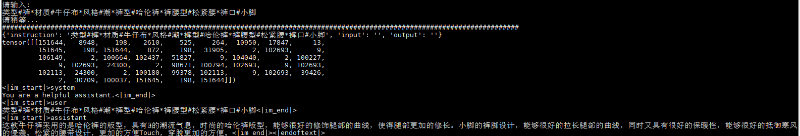

# Qwen-SFT
阿里通义千问(Qwen-7B-Chat/Qwen-7B), 微调/LORA/推理

## 踩坑
```python
1. tokenizer.encode输出(不会新增特殊字符), 为 [真实文本tokens]: 
2. chat-PROMPT: <|im_start|>system\nYou are a helpful assistant.<|im_end|>\n<|im_start|>user\n你好<|im_end|>\n<|im_start|>assistant\n
3.1 微调输入输出:
    输入："<|im_start|>system\nYou are a helpful assistant.<|im_end|>\n
          <|im_start|>user\n{问题}<|im_end|>\n<|im_start|>"
    输出："assistant\n{答案}<|im_end|><|endoftext|>"
    输入id: [151644, 输入tokens(user), 151643, 198, 151644]
    输出id: [输出tokens(assistant), 151643, 151645]
3.2 推理输入输出(assistant\n放置位置不同):
    输入："<|im_start|>system\nYou are a helpful assistant.<|im_end|>\n
          <|im_start|>user\n{问题}<|im_end|>\n<|im_start|>assistant\n"
    输出："{答案}<|im_end|><|endoftext|>"
    输入id: [151644, 输入tokens(user), 151643, 198, 151644, 输出tokens(assistant)]
    输出id: [151643, 151645]
4. 自定义的attention_mask没有使用(所以微调不能mask掉padding, 只能用right-padding):
    LLaMA为:
        attn_weights = attn_weights + attention_mask
        attn_weights = torch.max(attn_weights, torch.tensor(torch.finfo(attn_weights.dtype).min))
    QWen-7B没有使用:
        query_length, key_length = query.size(-2), key.size(-2)
        causal_mask = self.bias[:, :, key_length - query_length: key_length, :key_length]
        mask_value = torch.finfo(attn_weights.dtype).min
        mask_value = torch.full([], mask_value, dtype=attn_weights.dtype).to(attn_weights.device)
        attn_weights = torch.where(causal_mask, attn_weights.to(attn_weights.dtype), mask_value)
5. RuntimeError: unscale_() has already been called on this optimizer since the last update().
    微调语料太少导致的
```

## 环境配置
```shell
transformers>=4.31.0
torch>=1.10.1
rouge==1.0.1
nltk==3.6.6
peft>=0.2.0
numpy
tqdm
```

## 微调
```shell
地址: qwen_sft/ft_qwen

配置: qwen_sft/ft_qwen/config.py
训练: python train.py
推理: python predict.py
验证: python evaluation.py
接口: python post_api.py
```

## 微调日志(ADVGEN)


## 推理日志(LoRA, R=8)
sample-1:


sample-2:



## 数据集-中文
 - [https://huggingface.co/datasets/JosephusCheung/GuanacoDataset](https://huggingface.co/datasets/JosephusCheung/GuanacoDataset)
 - [https://huggingface.co/datasets/shareAI/shareGPT_cn](https://huggingface.co/datasets/shareAI/shareGPT_cn)
 - [https://huggingface.co/datasets/Mutonix/RefGPT-Fact](https://huggingface.co/datasets/Mutonix/RefGPT-Fact)
 - [https://huggingface.co/datasets/BAAI/COIG](https://huggingface.co/datasets/BAAI/COIG)
 - [https://github.com/Instruction-Tuning-with-GPT-4/GPT-4-LLM](https://github.com/Instruction-Tuning-with-GPT-4/GPT-4-LLM)
 - [https://github.com/carbonz0/alpaca-chinese-dataset](https://github.com/carbonz0/alpaca-chinese-dataset)
 - [https://github.com/LianjiaTech/BELLE](https://github.com/LianjiaTech/BELLE)
 - [https://github.com/PhoebusSi/Alpaca-CoT](https://github.com/PhoebusSi/Alpaca-CoT)
 - [https://github.com/Hello-SimpleAI/chatgpt-comparison-detection](https://github.com/Hello-SimpleAI/chatgpt-comparison-detection)
 - [https://github.com/yangjianxin1/Firefly](https://github.com/yangjianxin1/Firefly)
 - [https://github.com/XueFuzhao/InstructionWild](https://github.com/XueFuzhao/InstructionWild)
 - [https://github.com/OpenLMLab/MOSS](https://github.com/OpenLMLab/MOSS)
 - [https://github.com/thu-coai/Safety-Prompts](https://github.com/thu-coai/Safety-Prompts)
 - [https://github.com/LAION-AI/Open-Assistant](https://github.com/LAION-AI/Open-Assistant)
 - [https://github.com/TigerResearch/TigerBot](https://github.com/TigerResearch/TigerBot)

## 参考/感谢
 - [https://github.com/QwenLM/Qwen-7B](https://github.com/QwenLM/Qwen-7B)
 - [https://github.com/tatsu-lab/stanford_alpaca](https://github.com/tatsu-lab/stanford_alpaca)
 - [https://github.com/THUDM/ChatGLM-6B](https://github.com/THUDM/ChatGLM-6B)
 - [https://github.com/huggingface/peft](https://github.com/huggingface/peft)
 - [math23k](https://aclanthology.org/D17-1088)
 - [trl](https://github.com/lvwerra/trl)

## 免责申明
本项目相关资源仅供学术研究之用，使用涉及第三方代码的部分时，请严格遵循相应的开源协议。模型生成的内容受模型计算、随机性和量化精度损失等因素影响，本项目不对其准确性作出保证。对于模型输出的任何内容，本项目不承担任何法律责任，亦不对因使用相关资源和输出结果而可能产生的任何损失承担责任。
 - 大模型权重的详细协议见[QwenLM/Qwen-7B](https://github.com/QwenLM/Qwen-7B)

